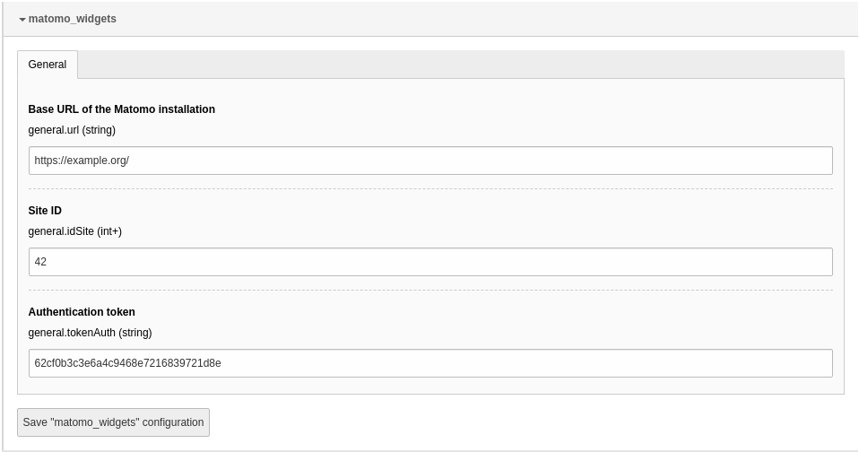

.. include:: ../Includes.txt

.. index:: Configuration

.. _configuration:

=============
Configuration
=============

Target group: **Developers, Integrators**

.. contents:: Table of Contents
   :depth: 1
   :local:

Extension configuration
=======================

To configure the extension, go to :guilabel:`Admin Tools` > :guilabel:`Settings`
> :guilabel:`Extension Configuration` and click on the
:guilabel:`Configure extensions` button. Open the :guilabel:`matomo_widgets`
configuration:

   Options in the extension configuration

Base URL of the Matomo installation
   Enter the URL of your Matomo installation.

   .. important::
      Please ensure TLS (https) is used for connecting to the Matomo
      installation as the authentication token is transferred in plain text!

Site ID
   Enter the site id for the website.

Authentication token
   Enter the authentication token (token_auth). It is recommended to create an
   own user in Matomo which has only read access to this site.

Cache configuration
===================

The extension stores the data retrieved from the Matomo installation in a cache
for better performance. You can adjust the cache configuration, have a look
into :file:`ext_localconf.php` for the current configuration.

Permission of widgets
=====================

You have to grant access for editors to use some or all of the Matomo widgets.
You can find more information in the :ref:`Dashboard manual
<t3dashboard:permission-handling-of-widgets>`.
