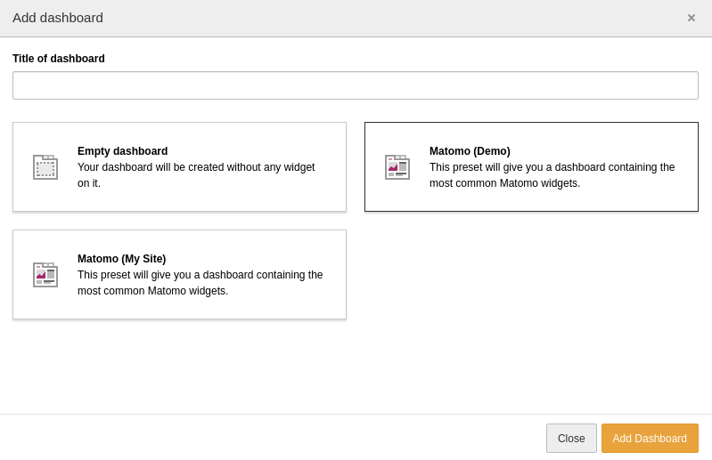

.. include:: ../Includes.txt

.. _dashboard:

=========
Dashboard
=========

You can add the :ref:`widgets <widgets>` to every TYPO dashboard. For your
convenience, there is also a preset available with the most common widgets. You
can select it when creating a new dashboard:

.. figure:: ../Images/DashboardPresetSelection.png
   :alt: Select the Matomo dashboard preset
   :class: with-border

   Select the Matomo dashboard preset

If you have a multi-site TYPO3 installation which connects to different Matomo
instances there are presets for each :ref:`configured <site-configuration>`
Matomo instance available:

   Select one of the Matomo dashboard preset

.. note::
   The widget titles in the widget selection modal are always English if more
   than one Matomo instance is configured.
