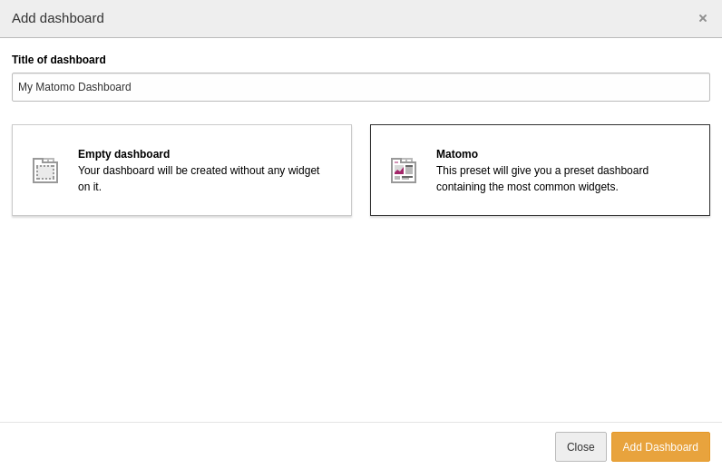

.. include:: ../Includes.txt

.. _dashboard:

=========
Dashboard
=========

You can add the :ref:`widgets <widgets>` to every TYPO dashboard. For your
convenience, there is also a preset available with the most common widgets. You
can select it when creating a new dashboard:

   Select the Matomo dashboard preset
