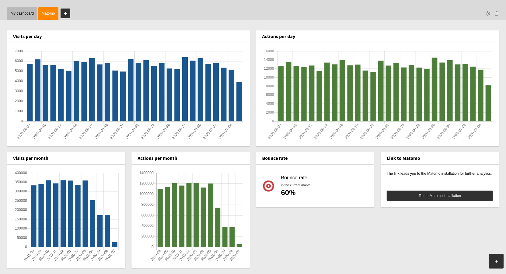

.. include:: ../Includes.txt

.. _introduction:

============
Introduction
============

.. _what-it-does:

What does it do?
================

The extension provides charts for various `Matomo <https://www.matomo.org/>`_
reports via the `Reporting API
<https://developer.matomo.org/guides/querying-the-reporting-api>`_.

The parameters of the widgets can be adjusted to your needs, e.g. in the
*Visits per month* widget display 24 month instead of 12 months.

.. _screenshots:

Screenshots
===========

   Example for a Matomo Dashboard

