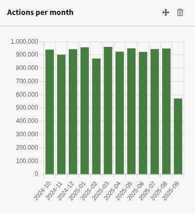

.. include:: ../Includes.txt

.. _widgets:

=======
Widgets
=======

You can add the Matomo widgets like any other widget to a dashboard. Please
note, that the permissions for editors have to be granted to be able to use
these widgets.

The following widgets are available:

.. contents::
   :depth: 1
   :local:

Visits per day
==============

This widget displays the number of visits per day for the last 28 days:

.. figure:: ../Images/WidgetVisitsPerDay.png
   :alt: Widget Visits per day

   Widget *Visits per day*

Visits per month
================

This widget displays the number of visits per month for the last 12 months:

.. figure:: ../Images/WidgetVisitsPerMonth.png
   :alt: Widget Visits per month

   Widget *Visits per month*

Actions per day
===============

This widget displays the number of actions per day for the last 28 days. Actions
are:

- Page views
- Downloads
- Clicks on outlinks

.. figure:: ../Images/WidgetActionsPerDay.png
   :alt: Widget Actions per day

   Widget *Actions per day*

Actions per month
=================

This widget displays the number of actions per month for the last 12 months.
Actions are:

- Page views
- Downloads
- Clicks on outlinks

   Widget *Actions per month*

Bounce rate
===========

The bounce rate for the current month shows this widget:

.. figure:: ../Images/WidgetBounceRate.png
   :alt: Widget Bounce Rate

   Widget *Bounce rate*

Browsers
========

The browser share for the current month shows this widget:

.. figure:: ../Images/WidgetBrowsers.png
   :alt: Widget Browsers

   Widget *Browsers*

Link to Matomo
==============

A call-to-action widget is used to show a link to the configured Matomo
installation:

.. figure:: ../Images/WidgetLinkToMatomo.png
   :alt: Widget Link to Matomo

   Widget *Link to Matomo*
