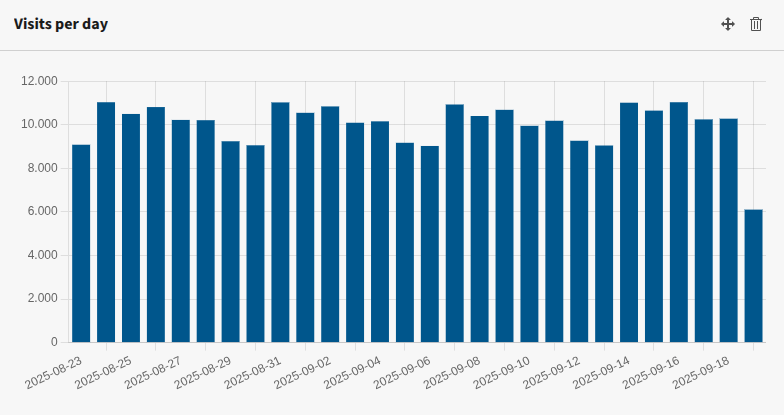
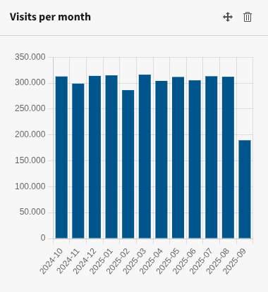
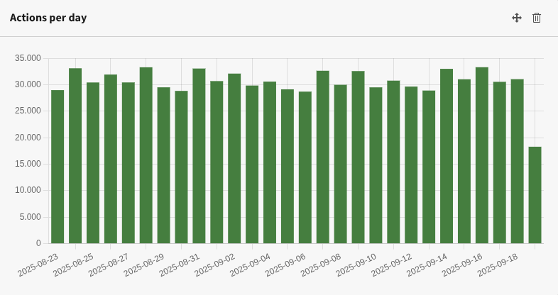
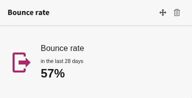
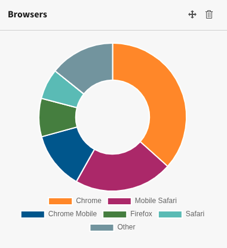
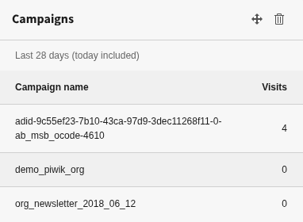
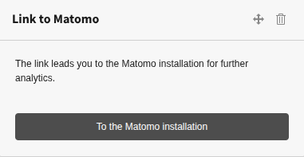

.. include:: ../Includes.txt

.. _widgets:

=======
Widgets
=======

You can add the Matomo widgets like any other widget to a dashboard. Please
note, that the permissions for editors have to be granted to be able to use
these widgets.

.. hint::
   Most widgets need an activated module in Matomo to work. If a module is not
   available, an error is displayed in the widget.

The following widgets are available:

.. contents::
   :depth: 1
   :local:

.. tip::
   Do you miss a widget? Open a `feature request
   <https://github.com/brotkrueml/typo3-matomo-widgets/issues>`_ and perhaps the
   widget is available in the next release.

Visits per day
==============

This widget displays the number of visits per day for the last 28 days:

   Widget *Visits per day*

Matomo module: VisitsSummary

Visits per month
================

This widget displays the number of visits per month for the last 12 months:

   Widget *Visits per month*

Matomo module: VisitsSummary

Actions per day
===============

This widget displays the number of actions per day for the last 28 days. Actions
are:

- Page views
- Downloads
- Clicks on outlinks

   Widget *Actions per day*

Matomo module: VisitsSummary

Actions per month
=================

This widget displays the number of actions per month for the last 12 months.
Actions are:

- Page views
- Downloads
- Clicks on outlinks

.. figure:: ../Images/WidgetActionsPerMonth.png
   :alt: Widget Actions per month

   Widget *Actions per month*

Matomo module: VisitsSummary

Bounce rate
===========

The bounce rate for the current month shows this widget:

   Widget *Bounce rate*

Matomo module: VisitsSummary

Browsers
========

The browser share for the current month shows this widget:

   Widget *Browsers*

Matomo module: DevicesDetection

Operating system families
=========================

The operating system families used by the visitors for the current month:

   Widget *Operating system families*

Matomo module: DevicesDetection

Campaigns
=========

Displays a report of the campaigns for the current month:

   Widget *Campaigns*

Matomo module: Referrers

Link to Matomo
==============

A call-to-action widget is used to show a link to the configured Matomo
installation:

   Widget *Link to Matomo*
